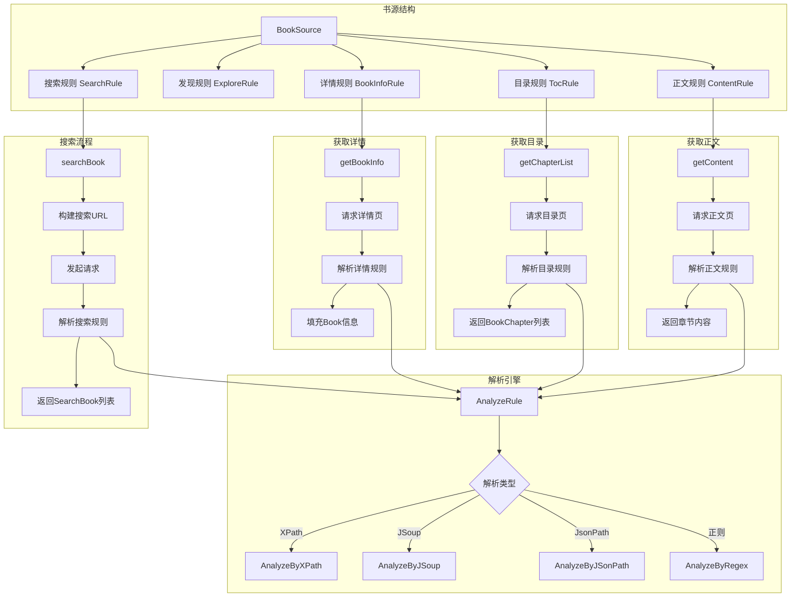

# Legado 书源解析流程



## 书源解析详解

### 1. 书源结构 (BookSource)

书源是 Legado 的核心概念，定义了如何从网站获取书籍信息。

#### 书源基本结构

```json
{
  "bookSourceUrl": "https://example.com",
  "bookSourceName": "示例书源",
  "bookSourceGroup": "小说",
  "searchUrl": "https://example.com/search?key={{key}}&page={{page}}",
  "exploreUrl": "分类1::https://example.com/cat1\n分类2::https://example.com/cat2",
  "ruleSearch": { ... },
  "ruleBookInfo": { ... },
  "ruleToc": { ... },
  "ruleContent": { ... }
}
```

#### 规则类型

##### SearchRule (搜索规则)

```json
{
  "ruleSearch": {
    "bookList": "//div[@class='book-list']/div",
    "name": ".//h3/text()",
    "author": ".//span[@class='author']/text()",
    "bookUrl": ".//a/@href",
    "coverUrl": ".//img/@src",
    "intro": ".//p[@class='intro']/text()",
    "kind": ".//span[@class='category']/text()",
    "lastChapter": ".//a[@class='last']/text()"
  }
}
```

##### BookInfoRule (详情规则)

```json
{
  "ruleBookInfo": {
    "name": "//h1/text()",
    "author": "//span[@class='author']/text()",
    "intro": "//div[@class='intro']/text()",
    "coverUrl": "//img[@class='cover']/@src",
    "tocUrl": "//a[@class='chapter-list']/@href",
    "kind": "//span[@class='category']/text()",
    "lastChapter": "//a[@class='last']/text()",
    "wordCount": "//span[@class='words']/text()"
  }
}
```

##### TocRule (目录规则)

```json
{
  "ruleToc": {
    "chapterList": "//div[@class='chapter-list']/a",
    "chapterName": "./text()",
    "chapterUrl": "./@href",
    "isVolume": "./@class=='volume'",
    "updateTime": "./@data-time"
  }
}
```

##### ContentRule (正文规则)

```json
{
  "ruleContent": {
    "content": "//div[@class='content']/text()",
    "nextContentUrl": "//a[@class='next']/@href",
    "webJs": "javascript:...",
    "sourceRegex": "https://example.com/content/.*"
  }
}
```

### 2. 解析引擎 (AnalyzeRule)

`AnalyzeRule` 是规则解析的核心引擎，支持多种解析方式。

#### 支持的解析方式

##### 1. XPath

使用 XPath 表达式定位元素：

```kotlin
// XPath 规则
"//div[@class='content']/text()"      // 获取文本
"//div[@class='list']/a/@href"        // 获取属性
"//div[@class='book']/@data-id"       // 获取data属性
```

##### 2. JSoup CSS 选择器

使用 CSS 选择器语法：

```kotlin
// JSoup 规则
"div.content@text"                    // 获取文本
"div.list a@href"                     // 获取href属性
"div.book@data-id"                    // 获取data属性
"div.intro@html"                      // 获取HTML
```

##### 3. JsonPath

解析 JSON 数据：

```kotlin
// JsonPath 规则
"$.data.list[*].name"                 // 获取所有name
"$.data.books[0].author"              // 获取第一个作者
"$..bookName"                         // 递归查找
```

##### 4. 正则表达式

使用正则提取内容：

```kotlin
// 正则规则
"##<div class=\"content\">(.*?)</div>##$1"
"##var chapterText = '(.*?)';##$1"
```

#### 规则组合

```kotlin
// 多规则组合
"//div[@class='content']@text##广告##"  // XPath + 正则
"$.data.content##<br/>##\n"            // JsonPath + 替换
```

### 3. 搜索流程

#### 步骤详解

```kotlin
// 1. 构建搜索URL
val searchUrl = bookSource.searchUrl
    .replace("{{key}}", key)
    .replace("{{page}}", page.toString())

// 2. 发起请求
val response = AnalyzeUrl(searchUrl).getStrResponseAwait()

// 3. 解析搜索规则
val rule = AnalyzeRule()
rule.setContent(response.body)

// 4. 获取书籍列表
val bookList = rule.xpath(bookSource.ruleSearch.bookList)

// 5. 提取书籍信息
for (bookElement in bookList) {
    val name = rule.xpath(bookSource.ruleSearch.name, bookElement)
    val author = rule.xpath(bookSource.ruleSearch.author, bookElement)
    val bookUrl = rule.xpath(bookSource.ruleSearch.bookUrl, bookElement)
    // ...
}
```

#### 搜索示例

```kotlin
WebBook.searchBookAwait(bookSource, "斗破苍穹", 1)
    .onSuccess { results ->
        results.forEach { book ->
            println("书名: ${book.name}")
            println("作者: ${book.author}")
            println("来源: ${book.origin}")
        }
    }
```

### 4. 获取书籍详情

#### 步骤详解

```kotlin
// 1. 请求详情页
val response = AnalyzeUrl(book.bookUrl).getStrResponseAwait()

// 2. 解析详情规则
val rule = AnalyzeRule()
rule.setContent(response.body)

// 3. 填充书籍信息
book.name = rule.xpath(bookSource.ruleBookInfo.name)
book.author = rule.xpath(bookSource.ruleBookInfo.author)
book.intro = rule.xpath(bookSource.ruleBookInfo.intro)
book.coverUrl = rule.xpath(bookSource.ruleBookInfo.coverUrl)
book.tocUrl = rule.xpath(bookSource.ruleBookInfo.tocUrl)
```

#### 详情示例

```kotlin
WebBook.getBookInfoAwait(bookSource, book)
    .let { updatedBook ->
        println("书名: ${updatedBook.name}")
        println("作者: ${updatedBook.author}")
        println("简介: ${updatedBook.intro}")
    }
```

### 5. 获取章节目录

#### 步骤详解

```kotlin
// 1. 请求目录页
val response = AnalyzeUrl(book.tocUrl).getStrResponseAwait()

// 2. 解析目录规则
val rule = AnalyzeRule()
rule.setContent(response.body)

// 3. 获取章节列表
val chapterList = rule.xpath(bookSource.ruleToc.chapterList)

// 4. 提取章节信息
val chapters = mutableListOf<BookChapter>()
for (chapterElement in chapterList) {
    val chapter = BookChapter()
    chapter.title = rule.xpath(bookSource.ruleToc.chapterName, chapterElement)
    chapter.url = rule.xpath(bookSource.ruleToc.chapterUrl, chapterElement)
    chapter.isVolume = rule.xpath(bookSource.ruleToc.isVolume, chapterElement).toBoolean()
    chapters.add(chapter)
}
```

#### 目录示例

```kotlin
WebBook.getChapterListAwait(bookSource, book)
    .onSuccess { chapters ->
        chapters.forEach { chapter ->
            println("章节: ${chapter.title}")
            println("URL: ${chapter.url}")
        }
    }
```

### 6. 获取章节正文

#### 步骤详解

```kotlin
// 1. 请求正文页
val response = AnalyzeUrl(chapter.url).getStrResponseAwait()

// 2. 解析正文规则
val rule = AnalyzeRule()
rule.setContent(response.body)

// 3. 提取正文内容
val content = rule.xpath(bookSource.ruleContent.content)

// 4. 处理多页正文
val nextUrl = rule.xpath(bookSource.ruleContent.nextContentUrl)
if (nextUrl.isNotEmpty()) {
    // 继续获取下一页
}
```

#### 正文示例

```kotlin
WebBook.getContentAwait(bookSource, book, chapter)
    .let { content ->
        println(content)
    }
```

### 7. 高级特性

#### 登录检测

```kotlin
// 书源定义登录检测JS
"loginCheckJs": "if(response.code()==200){result=response.body();}"

// 执行登录检测
val checkJs = bookSource.loginCheckJs
if (!checkJs.isNullOrBlank()) {
    analyzeUrl.evalJS(checkJs, response)
}
```

#### 请求头自定义

```json
{
  "header": {
    "User-Agent": "Mozilla/5.0",
    "Referer": "https://example.com",
    "Cookie": "session=xxx"
  }
}
```

#### JS 脚本执行

```json
{
  "ruleContent": {
    "content": "@js:
      let result = [];
      let list = document.querySelectorAll('p');
      for(let i=0; i<list.length; i++){
        result.push(list[i].textContent);
      }
      result.join('\\n');
    "
  }
}
```

### 8. 规则调试

#### 调试方法

```kotlin
// 使用Debug类记录调试信息
Debug.log(bookSource.bookSourceUrl, "开始解析")
Debug.log(bookSource.bookSourceUrl, "规则: $rule")
Debug.log(bookSource.bookSourceUrl, "结果: $result")
```

#### 调试界面

应用内置书源调试界面，可以：
- 实时查看请求过程
- 查看规则解析结果
- 查看错误信息
- 测试规则正确性

### 9. 性能优化

- **并发控制**: 使用信号量限制并发请求数
- **缓存机制**: 缓存已解析的内容
- **增量加载**: 渐进式加载目录
- **预下载**: 预下载后续章节

### 10. 错误处理

```kotlin
WebBook.getContentAwait(bookSource, book, chapter)
    .onSuccess { content ->
        // 处理成功
    }
    .onFailure { error ->
        when (error) {
            is ContentEmptyException -> "正文为空"
            is NoStackTraceException -> "规则错误"
            else -> "网络错误"
        }
    }
```
