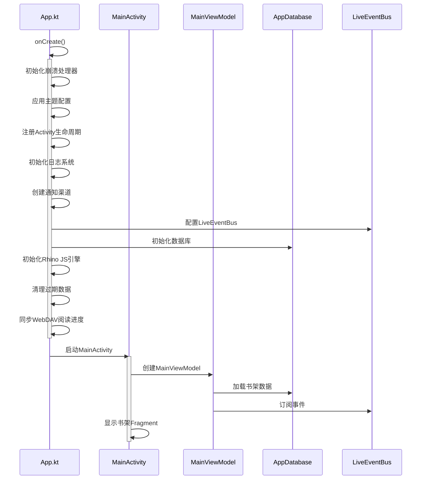

# Legado 应用启动流程



## 启动流程详解

### 1. Application 初始化 (App.kt)

#### 基础配置
- 初始化崩溃处理器 (`CrashHandler`)
- 应用主题配置 (`applyDayNightInit`)
- 注册Activity生命周期回调 (`LifecycleHelp`)

#### 核心组件初始化
- 初始化日志系统 (`LogUtils.init`)
- 创建通知渠道 (`createNotificationChannels`)
  - 下载通知渠道
  - 朗读通知渠道
  - Web服务通知渠道

#### 事件总线配置
```kotlin
LiveEventBus.config()
    .lifecycleObserverAlwaysActive(true)
    .autoClear(false)
    .enableLogger(BuildConfig.DEBUG || AppConfig.recordLog)
    .setLogger(EventLogger())
```

#### 数据库初始化
- 使用 Room 数据库
- 数据库名称: `legado.db`
- 当前版本: 90
- 支持自动迁移

#### JS引擎初始化
- 初始化 Rhino 脚本引擎
- 注册自定义 Java 对象包装器
- 支持书源规则执行

#### 清理任务
- 清除过期缓存数据
- 清除过期搜索记录
- 清除无效规则数据
- 清除无效书籍缓存

#### 同步任务
- 同步 WebDAV 阅读进度

### 2. MainActivity 启动

#### 主界面创建
- 创建 `MainViewModel`
- 加载书架数据
- 订阅事件总线
- 显示书架 Fragment

### 3. 关键初始化顺序

1. **崩溃处理** → 确保异常能被捕获
2. **主题配置** → 确保UI显示正确
3. **日志系统** → 确保后续操作可追踪
4. **数据库** → 确保数据访问可用
5. **JS引擎** → 确保书源规则可执行
6. **清理任务** → 清理历史数据
7. **同步任务** → 同步云端数据

### 4. 性能优化

- 异步初始化：非关键任务在协程中异步执行
- 延迟加载：部分功能按需加载
- 预加载：Cronet 网络库预下载
