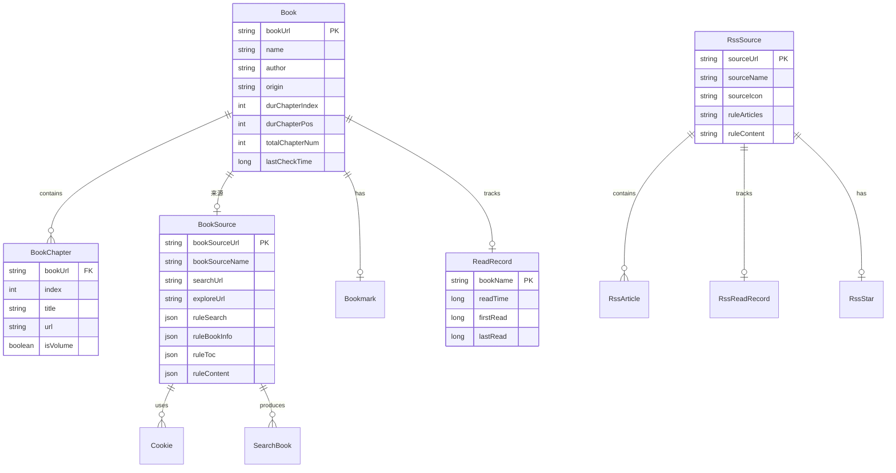

# Legado 数据库架构



## 数据库详解

### 数据库基本信息

- **数据库名称**: `legado.db`
- **当前版本**: 90
- **ORM框架**: Room
- **位置**: `io.legado.app.data.AppDatabase`

### 核心实体表

#### 1. Book (书籍表)

存储书籍的基本信息和阅读进度。

| 字段 | 类型 | 说明 |
|------|------|------|
| bookUrl | String | 主键，书籍唯一标识 |
| name | String | 书名 |
| author | String | 作者 |
| origin | String | 书源地址 |
| tocUrl | String | 目录页URL |
| durChapterIndex | Int | 当前章节索引 |
| durChapterPos | Int | 当前章节位置 |
| totalChapterNum | Int | 总章节数 |
| lastCheckTime | Long | 最后检查时间 |
| lastCheckCount | Int | 最后检查数量 |
| readConfig | String | 阅读配置JSON |

#### 2. BookChapter (章节表)

存储书籍的章节信息。

| 字段 | 类型 | 说明 |
|------|------|------|
| bookUrl | String | 外键，关联Book |
| index | Int | 章节索引 |
| title | String | 章节标题 |
| url | String | 章节URL |
| isVolume | Boolean | 是否为卷 |
| tag | String | 标签 |
| startPos | Int | 起始位置 |
| endPos | Int | 结束位置 |

#### 3. BookSource (书源表)

存储书源配置和规则。

| 字段 | 类型 | 说明 |
|------|------|------|
| bookSourceUrl | String | 主键，书源地址 |
| bookSourceName | String | 书源名称 |
| bookSourceGroup | String | 书源分组 |
| searchUrl | String | 搜索URL规则 |
| exploreUrl | String | 发现URL规则 |
| ruleSearch | JSON | 搜索规则 |
| ruleBookInfo | JSON | 详情规则 |
| ruleToc | JSON | 目录规则 |
| ruleContent | JSON | 正文规则 |
| loginUrl | String | 登录地址 |
| loginCheckJs | String | 登录检测JS |

#### 4. RssSource (RSS源表)

存储RSS订阅源配置。

| 字段 | 类型 | 说明 |
|------|------|------|
| sourceUrl | String | 主键，源地址 |
| sourceName | String | 源名称 |
| sourceIcon | String | 源图标 |
| ruleArticles | String | 文章列表规则 |
| ruleContent | String | 文章内容规则 |

#### 5. ReadRecord (阅读记录表)

存储阅读时长统计。

| 字段 | 类型 | 说明 |
|------|------|------|
| bookName | String | 主键，书名 |
| readTime | Long | 累计阅读时长 |
| firstRead | Long | 首次阅读时间 |
| lastRead | Long | 最后阅读时间 |

### 辅助实体表

#### 6. Bookmark (书签表)
- bookName: 书名
- bookAuthor: 作者
- chapterIndex: 章节索引
- chapterPos: 章节位置
- content: 书签内容

#### 7. ReplaceRule (替换规则表)
- name: 规则名称
- group: 规则分组
- pattern: 正则表达式
- replacement: 替换内容

#### 8. Cookie (Cookie表)
- url: URL地址
| key: Cookie键
| value: Cookie值

#### 9. Cache (缓存表)
- key: 缓存键
- value: 缓存值
- deadline: 过期时间

#### 10. HttpTTS (HTTP TTS表)
- url: TTS服务地址
- name: TTS名称
- rule: TTS规则

### DAO 接口

```kotlin
abstract class AppDatabase : RoomDatabase() {
    abstract val bookDao: BookDao
    abstract val bookGroupDao: BookGroupDao
    abstract val bookSourceDao: BookSourceDao
    abstract val bookChapterDao: BookChapterDao
    abstract val replaceRuleDao: ReplaceRuleDao
    abstract val searchBookDao: SearchBookDao
    abstract val rssSourceDao: RssSourceDao
    abstract val bookmarkDao: BookmarkDao
    abstract val rssArticleDao: RssArticleDao
    abstract val cookieDao: CookieDao
    abstract val readRecordDao: ReadRecordDao
    abstract val httpTTSDao: HttpTTSDao
    abstract val cacheDao: CacheDao
}
```

### 数据库迁移

项目使用 Room 的自动迁移功能：

```kotlin
@Database(
    version = 90,
    autoMigrations = [
        AutoMigration(from = 43, to = 44),
        AutoMigration(from = 44, to = 45),
        // ... 更多迁移
    ]
)
```

### 数据库初始化回调

```kotlin
val dbCallback = object : Callback() {
    override fun onOpen(db: SupportSQLiteDatabase) {
        // 初始化默认书籍分组
        db.execSQL(insertBookGroupAllSql)
        db.execSQL(insertBookGroupLocalSql)
        db.execSQL(insertBookGroupAudioSql)
        // ...
    }
}
```

### 查询优化

- **索引**: 在常用查询字段上建立索引
- **分页**: 大数据量查询使用分页
- **懒加载**: 按需加载章节数据
- **缓存**: 热点数据内存缓存
