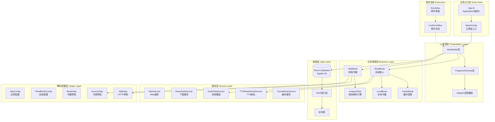

# Legado 整体架构层次图

## 架构说明

### 应用入口层
- **App.kt**: Application 类，负责应用初始化、全局配置、服务启动
- **MainActivity**: 主界面入口，管理 Fragment 导航

### UI表现层
- **ViewModel层**: 管理UI状态和业务逻辑
- **Fragment/Activity层**: 界面展示和用户交互
- **Adapter层**: 列表数据适配

### 业务逻辑层
- **ReadBook**: 阅读核心逻辑，管理阅读状态、章节加载、进度保存
- **WebBook**: 网络书籍请求和解析
- **LocalBook**: 本地书籍解析（TXT/EPUB/UMD/MOBI/PDF）
- **AnalyzeRule**: 规则解析引擎，支持XPath/JSoup/JsonPath/正则
- **CacheBook**: 书籍缓存管理

### 数据层
- **Room Database**: 本地数据库存储
- **DAO接口层**: 数据访问对象
- **实体类**: 数据模型定义

### 服务层
- **WebService**: Web服务，提供远程管理接口
- **DownloadService**: 后台下载服务
- **AudioPlayService**: 音频播放服务
- **TTSReadAloudService**: TTS朗读服务
- **CacheBookService**: 缓存服务

### 帮助/配置层
- **AppConfig**: 应用全局配置
- **ReadBookConfig**: 阅读相关配置
- **BookHelp**: 书籍操作帮助类
- **HttpHelp**: HTTP请求帮助类
- **SourceHelp**: 书源管理帮助类

### 事件总线
- **LiveEventBus**: 基于LiveData的事件总线，用于跨组件通信
- **EventBus**: 事件常量定义
