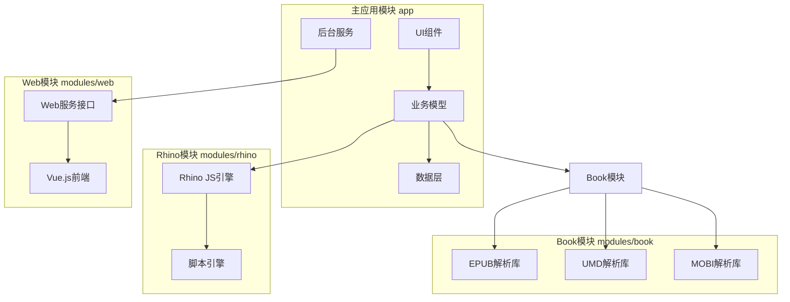

# Legado 模块依赖关系



## 模块详解

### 1. 主应用模块 (app)

主应用模块是核心模块，包含所有业务逻辑和UI实现。

#### 目录结构

```
app/
├── src/main/java/io/legado/app/
│   ├── api/              # API接口
│   ├── base/             # 基础类
│   ├── constant/         # 常量定义
│   ├── data/             # 数据层
│   ├── exception/        # 异常类
│   ├── help/             # 帮助类
│   ├── lib/              # 工具库
│   ├── model/            # 业务模型
│   ├── receiver/         # 广播接收器
│   ├── service/          # 后台服务
│   ├── ui/               # UI层
│   ├── utils/            # 工具类
│   ├── web/              # Web服务
│   └── App.kt            # Application类
└── build.gradle
```

#### 主要组件

- **UI组件**: Activity、Fragment、Adapter、Dialog
- **业务模型**: ReadBook、WebBook、LocalBook、AnalyzeRule
- **后台服务**: WebService、DownloadService、AudioPlayService
- **数据层**: Room数据库、DAO、实体类

### 2. Rhino模块 (modules/rhino)

Rhino 是 Mozilla 开发的 JavaScript 引擎，用于执行书源规则中的 JS 脚本。

#### 目录结构

```
modules/rhino/
├── lib/
│   └── rhino-1.7.14.jar  # Rhino库
├── src/main/java/com/script/
│   ├── rhino/
│   │   ├── RhinoScriptEngine.kt      # 脚本引擎
│   │   ├── RhinoWrapFactory.kt       # 对象包装工厂
│   │   ├── ReadOnlyJavaObject.kt     # 只读Java对象
│   │   └── ProtectedNativeJavaClass.kt # 保护Java类
│   ├── AbstractScriptEngine.kt       # 抽象脚本引擎
│   ├── ScriptBindings.kt             # 脚本绑定
│   └── ScriptContext.kt              # 脚本上下文
└── build.gradle
```

#### 核心功能

- **脚本执行**: 执行书源规则中的 JS 脚本
- **Java桥接**: JS 中调用 Java 对象和方法
- **安全沙箱**: 限制 JS 脚本的访问权限
- **性能优化**: 脚本编译和缓存

#### 使用示例

```kotlin
// 创建脚本引擎
val engine = RhinoScriptEngine()

// 执行JS脚本
val result = engine.eval("""
    var book = source.getBook();
    book.name;
""")

// JS中可用的对象
// - source: 书源对象
// - book: 书籍对象
// - chapter: 章节对象
// - result: 解析结果
```

### 3. Book模块 (modules/book)

Book 模块提供各种电子书格式的解析支持。

#### 目录结构

```
modules/book/
├── src/main/java/me/ag2s/
│   ├── epublib/          # EPUB解析库
│   │   ├── domain/       # 领域模型
│   │   ├── epub/         # EPUB处理
│   │   └── util/         # 工具类
│   ├── umdlib/           # UMD解析库
│   │   ├── domain/       # 领域模型
│   │   ├── tool/         # 工具类
│   │   └── umd/          # UMD处理
│   └── base/             # 基础类
└── build.gradle
```

#### 支持的格式

##### EPUB
- EPUB 2.0
- EPUB 3.0
- 支持 HTML、CSS、图片
- 支持目录导航

```kotlin
// EPUB解析
val epubBook = EpubReader().readEpub(FileInputStream(file))
val content = epubBook.contents
val chapters = epubBook.spine.spineReferences
```

##### UMD
- UMD 格式电子书
- 支持图文混排
- 支持章节目录

```kotlin
// UMD解析
val umdBook = UmdReader().read(file)
val chapters = umdBook.chapters
```

##### MOBI
- MOBI 格式电子书
- Kindle 格式支持
- 支持 KF8 格式

```kotlin
// MOBI解析
val mobiBook = MobiReader().read(file)
val content = mobiBook.content
```

### 4. Web模块 (modules/web)

Web 模块提供基于 Vue.js 的 Web 管理界面。

#### 目录结构

```
modules/web/
├── public/               # 静态资源
├── src/
│   ├── api/              # API接口
│   ├── assets/           # 资源文件
│   ├── components/       # Vue组件
│   ├── config/           # 配置文件
│   ├── hooks/            # Vue Hooks
│   ├── pages/            # 页面
│   ├── plugins/          # 插件
│   ├── router/           # 路由
│   ├── store/            # Vuex Store
│   ├── utils/            # 工具类
│   ├── views/            # 视图
│   └── main.ts           # 入口文件
├── index.html
├── package.json
└── vite.config.ts
```

#### 主要功能

- **书架管理**: 查看、管理书架
- **书源编辑**: 编辑书源规则
- **备份管理**: 备份和恢复数据
- **阅读界面**: Web端阅读

#### 技术栈

- **Vue 3**: 前端框架
- **TypeScript**: 类型支持
- **Vite**: 构建工具
- **Vuex**: 状态管理
- **Vue Router**: 路由管理

### 5. 模块间通信

#### 依赖关系

```
app (主应用)
 ├── rhino (JS引擎)
 ├── book (电子书解析)
 └── web (Web界面)
```

#### 通信方式

1. **直接调用**: app 直接调用其他模块的 API
2. **接口抽象**: 通过接口解耦模块间依赖
3. **事件总线**: 跨模块事件通知

### 6. 构建配置

#### app/build.gradle

```gradle
dependencies {
    implementation project(':modules:rhino')
    implementation project(':modules:book')
}
```

#### modules/rhino/build.gradle

```gradle
dependencies {
    implementation files('lib/rhino-1.7.14.jar')
}
```

#### modules/book/build.gradle

```gradle
dependencies {
    // 无外部依赖
}
```

### 7. 模块优势

- **解耦**: 各模块独立开发
- **复用**: 模块可被其他项目使用
- **测试**: 模块独立测试
- **维护**: 降低维护成本
- **编译**: 增量编译加速
