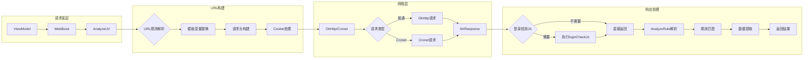

# Legado 网络请求架构



## 网络请求详解

### 1. 请求入口 (WebBook)

`WebBook` 是所有网络书籍请求的统一入口：

```kotlin
object WebBook {
    // 搜索书籍
    fun searchBook(scope, bookSource, key, page)
    suspend fun searchBookAwait(bookSource, key, page)
    
    // 发现书籍
    fun exploreBook(scope, bookSource, url, page)
    suspend fun exploreBookAwait(bookSource, url, page)
    
    // 获取书籍详情
    fun getBookInfo(scope, bookSource, book)
    suspend fun getBookInfoAwait(bookSource, book)
    
    // 获取章节目录
    fun getChapterList(scope, bookSource, book)
    suspend fun getChapterListAwait(bookSource, book)
    
    // 获取章节正文
    fun getContent(scope, bookSource, book, chapter)
    suspend fun getContentAwait(bookSource, book, chapter)
}
```

### 2. URL构建 (AnalyzeUrl)

`AnalyzeUrl` 负责解析和构建请求URL：

```kotlin
class AnalyzeUrl(
    mUrl: String,           // URL规则
    key: String? = null,    // 搜索关键词
    page: Int? = null,      // 页码
    baseUrl: String? = null,// 基础URL
    source: BaseSource? = null, // 书源
    ruleData: RuleData? = null, // 规则数据
    coroutineContext: CoroutineContext? = null
) {
    // URL模板变量替换
    // {{key}} -> 搜索关键词
    // {{page}} -> 页码
    // {{baseUrl}} -> 基础URL
    
    // 构建请求头
    fun getHeaderMap(): Map<String, String>
    
    // 执行请求
    fun getStrResponseAwait(): StrResponse
}
```

#### URL模板示例

```
搜索URL: https://example.com/search?key={{key}}&page={{page}}
发现URL: https://example.com/explore?page={{page}}
```

### 3. 网络层实现

#### OkHttp 方式

```kotlin
val okHttpClient: OkHttpClient by lazy {
    OkHttpClient.Builder()
        .connectTimeout(30, TimeUnit.SECONDS)
        .readTimeout(30, TimeUnit.SECONDS)
        .writeTimeout(30, TimeUnit.SECONDS)
        .addInterceptor(DecompressInterceptor)
        .addInterceptor(CronetInterceptor)
        .build()
}
```

#### Cronet 方式

Cronet 是 Chromium 网络库的 Android 封装：

- 更快的网络请求
- 支持 HTTP/2
- 支持 QUIC 协议
- 自动请求优先级管理

```kotlin
object Cronet {
    // 预下载 Cronet so 库
    fun preDownload()
    
    // 创建 Cronet 引擎
    fun createEngine(): CronetEngine
}
```

### 4. 请求头处理

#### 自定义请求头

书源可以定义自定义请求头：

```json
{
  "header": {
    "User-Agent": "Mozilla/5.0",
    "Referer": "https://example.com",
    "Cookie": "session=xxx"
  }
}
```

#### Cookie 管理

```kotlin
class CookieManager : CookieManagerInterface {
    // 保存 Cookie
    fun saveCookie(url: String, cookies: List<String>)
    
    // 获取 Cookie
    fun getCookies(url: String): String
    
    // 清除 Cookie
    fun clearCookie(url: String)
}
```

### 5. 响应处理

#### StrResponse 结构

```kotlin
data class StrResponse(
    val url: String,           // 最终URL（可能重定向）
    val body: String,          // 响应体
    val raw: Response          // 原始响应对象
) {
    // 获取响应码
    fun code(): Int
    
    // 获取响应头
    fun header(name: String): String?
    
    // 获取所有响应头
    fun headers(): Headers
}
```

#### 登录检测

```kotlin
val checkJs = bookSource.loginCheckJs
if (!checkJs.isNullOrBlank()) {
    // 执行登录检测JS
    val result = analyzeUrl.evalJS(checkJs, response)
    // 返回处理后的响应
}
```

### 6. 规则解析 (AnalyzeRule)

`AnalyzeRule` 是规则解析的核心引擎：

```kotlin
class AnalyzeRule(
    val book: Book? = null,
    val source: BaseSource? = null,
    val isToc: Boolean = false,
    val isFromBookInfo: Boolean = false
) {
    // 设置解析内容
    fun setContent(content: String): AnalyzeRule
    
    // XPath 解析
    fun xpath(xpath: String): String?
    
    // JSoup CSS 选择器
    fun select(css: String): String?
    
    // JsonPath 解析
    fun jsonPath(path: String): String?
    
    // 正则表达式
    fun regex(pattern: String): String?
    
    // 执行 JS 脚本
    fun evalJS(js: String): Any?
}
```

#### 解析方式

1. **XPath**: `//div[@class="content"]/text()`
2. **JSoup**: `div.content@text`
3. **JsonPath**: `$.data.list[*].name`
4. **正则**: `##<div>(.*?)</div>##$1`

### 7. 并发控制

```kotlin
// 使用信号量控制并发数
val semaphore = Semaphore(3)

Coroutine.async(scope, semaphore = semaphore) {
    // 执行请求
}
```

### 8. 错误处理

```kotlin
// 网络请求异常拦截器
class OkHttpExceptionInterceptor : Interceptor {
    override fun intercept(chain: Chain): Response {
        try {
            return chain.proceed(chain.request())
        } catch (e: Exception) {
            // 处理异常
            throw e
        }
    }
}
```

### 9. 请求流程示例

```kotlin
// 搜索书籍
WebBook.searchBookAwait(bookSource, "斗破苍穹", 1)
    .onSuccess { searchResults ->
        // 处理搜索结果
    }
    .onError { error ->
        // 处理错误
    }

// 获取书籍详情
WebBook.getBookInfoAwait(bookSource, book)
    .let { updatedBook ->
        // 更新书籍信息
    }

// 获取章节目录
WebBook.getChapterListAwait(bookSource, book)
    .onSuccess { chapters ->
        // 保存章节列表
    }

// 获取章节正文
WebBook.getContentAwait(bookSource, book, chapter)
    .let { content ->
        // 显示正文
    }
```

### 10. 性能优化

- **连接池**: 复用HTTP连接
- **缓存**: 响应缓存机制
- **压缩**: 支持Gzip压缩
- **并发控制**: 限制并发请求数
- **超时设置**: 合理的超时配置
- **重试机制**: 失败自动重试
