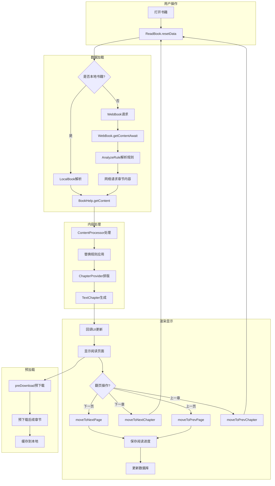

# Legado 阅读核心流程



## 阅读流程详解

### 1. 打开书籍 (resetData)

当用户打开一本书时，`ReadBook` 对象会执行以下操作：

```kotlin
fun resetData(book: Book) {
    // 1. 释放之前的资源
    releaseAndCancel()
    
    // 2. 设置当前书籍
    ReadBook.book = book
    
    // 3. 加载阅读记录
    readRecord.readTime = appDb.readRecordDao.getReadTime(book.name)
    
    // 4. 获取章节信息
    chapterSize = appDb.bookChapterDao.getChapterCount(book.bookUrl)
    
    // 5. 初始化内容处理器
    contentProcessor = ContentProcessor.get(book)
    
    // 6. 设置当前章节位置
    durChapterIndex = book.durChapterIndex
    durChapterPos = book.durChapterPos
    
    // 7. 判断是否本地书籍
    isLocalBook = book.isLocal
    
    // 8. 更新书源信息
    upWebBook(book)
}
```

### 2. 数据加载

#### 本地书籍加载
- **TXT**: 直接读取文本内容
- **EPUB**: 使用 `EpubFile` 解析
- **UMD**: 使用 `UmdFile` 解析
- **MOBI**: 使用 `MobiFile` 解析
- **PDF**: 使用 `PdfFile` 解析

#### 网络书籍加载
1. 获取章节信息 (`BookChapter`)
2. 构建请求 URL (`AnalyzeUrl`)
3. 执行网络请求
4. 解析正文规则 (`AnalyzeRule`)
5. 提取正文内容

### 3. 内容处理

#### ContentProcessor 处理流程
```kotlin
// 1. 获取内容处理器
val processor = ContentProcessor.get(book.name, book.origin)

// 2. 应用替换规则
val contents = processor.getContent(book, chapter, content)

// 3. 处理章节标题
val displayTitle = chapter.getDisplayTitle(replaceRules)
```

#### ChapterProvider 排版
- 文本分段
- 计算行高
- 分页处理
- 生成 `TextChapter` 对象

### 4. 翻页操作

#### 下一页 (moveToNextPage)
```kotlin
fun moveToNextPage(): Boolean {
    curTextChapter?.let {
        val nextPagePos = it.getNextPageLength(durChapterPos)
        if (nextPagePos >= 0) {
            durChapterPos = nextPagePos
            callBack?.upContent()
            saveRead(true)
            return true
        }
    }
    return false
}
```

#### 下一章 (moveToNextChapter)
```kotlin
fun moveToNextChapter(): Boolean {
    if (durChapterIndex < simulatedChapterSize - 1) {
        durChapterPos = 0
        durChapterIndex++
        
        // 章节缓存滑动
        prevTextChapter = curTextChapter
        curTextChapter = nextTextChapter
        nextTextChapter = null
        
        // 加载新章节
        loadContent(durChapterIndex)
        loadContent(durChapterIndex + 1)
        
        saveRead()
        return true
    }
    return false
}
```

### 5. 预下载机制

```kotlin
private fun preDownload() {
    if (book?.isLocal == true) return
    
    launch(IO) {
        // 向前预下载
        for (i in durChapterIndex + 2..maxChapterIndex) {
            downloadIndex(i)
        }
        
        // 向后预下载
        for (i in durChapterIndex - 2 downTo minChapterIndex) {
            downloadIndex(i)
        }
    }
}
```

### 6. 进度保存

```kotlin
fun saveRead() {
    book?.let {
        it.durChapterIndex = durChapterIndex
        it.durChapterPos = durChapterPos
        it.durChapterTime = System.currentTimeMillis()
        it.update() // 更新数据库
    }
}
```

### 7. 章节缓存策略

- **prevTextChapter**: 上一章内容
- **curTextChapter**: 当前章节内容
- **nextTextChapter**: 下一章内容

这种三章节缓存策略确保：
- 翻页流畅无延迟
- 减少网络请求
- 提升用户体验

### 8. 阅读配置

- 字体大小
- 行间距
- 段间距
- 页边距
- 翻页动画
- 背景主题
- 简繁转换
